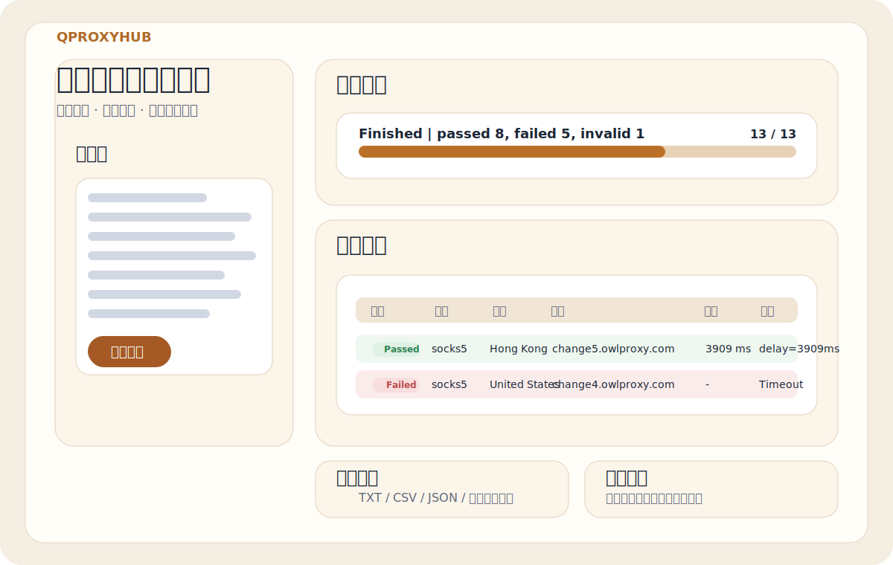
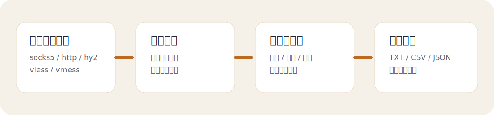

<div align="center">


# Qproxyhub

### 本地代理测试与导出工作台

[](#)
[](#)
[](#)
[](#)

一个专注于 **代理连通性检测、历史复测、结果筛选与多客户端导出** 的本地工具。

<p>
  <a href="https://github.com/hnsxyren1023-commits/Qproxyhub/releases/tag/v0.1.0">
    
  </a>
  <a href="https://github.com/hnsxyren1023-commits/Qproxyhub/releases/tag/v0.1.0">
    
  </a>
</p>

</div>

---

## 项目定位

Qproxyhub 是独立于 `mihomo + UI` 产品线之外的另一条产品线，主要解决这些问题：

- 批量测试代理链接是否可用
- 观察真实延迟与失败原因
- 对失败项进行二次复测
- 保存历史任务，回看某次测试快照
- 将筛选后的节点导出为多种客户端可用格式

它更偏向“测试与运维工具”，而不是代理客户端本身。

---

## 主要特性

- 支持 `socks5`、`http`、`hy2`、`vless`、`vmess`
- 支持逐条实时反馈，不必等待整批结束
- 支持历史任务保存与回看
- 支持失败项重试、全量重测
- 支持结果排序、筛选、勾选、多选复制
- 支持导出 `TXT`、`CSV`、`JSON`
- 支持导出到 `mihomo`、`Clash Verge`、`v2rayN`、`NekoBox / Nekoray`
- 支持 `.exe` 启动器、`.bat` 启动器、PowerShell 启动三种入口

---

## 界面预览

<div align="center">
  
</div>

---

## 工作流

<div align="center">
  
</div>

---

## 当前适用场景

- 对代理池做首轮可用性筛选
- 对同一批代理做定期抽检
- 在正式导入客户端前先做验证
- 保留一批“通过节点”并导出成配置
- 排查“到底是节点坏了，还是客户端配置有问题”

---

## 支持协议

| 协议 | 当前状态 |
| --- | --- |
| `socks5://` | 已支持 |
| `http://` | 已支持 |
| `hy2://` | 已支持 |
| `vless://` | 已支持 |
| `vmess://` | 已支持 |

---

## 导出目标

| 目标 | 当前导出形式 |
| --- | --- |
| `mihomo` | YAML 配置 |
| `Clash Verge` | YAML 配置 |
| `v2rayN` | 原始链接集合 |
| `NekoBox / Nekoray` | 原始链接集合 |
| 通用结果归档 | `TXT / CSV / JSON` |

---

## 快速开始

### 先下载什么

如果你是第一次使用，推荐优先下载：

- `Qproxyhub-v0.1.0-portable.zip`

如果你已经拿到了完整目录，只想单独点击启动器，也可以使用：

- `Qproxyhub.exe`

### 方式一：直接双击 `.exe`

如果你下载的是完整项目目录，可以直接运行：

```text
release\Qproxyhub.exe
```

说明：

- 它会自动在项目目录下启动本地服务
- 随后自动打开浏览器访问 `http://127.0.0.1:8866/`

### 方式二：双击批处理

```text
Qproxyhub-启动.bat
```

### 方式三：PowerShell 手动启动

先进入项目目录，再执行：

```powershell
cd D:\Xcode\20260423_Qproxyhub
powershell -ExecutionPolicy Bypass -File .\start-proxy-tester.ps1
```

注意：

- 你截图里报错的原因，就是在 `C:\Users\Redme_H1K3` 目录下直接运行了 `.\start-proxy-tester.ps1`
- `.\` 只表示“当前目录”，所以必须先 `cd` 到项目目录，或者写完整路径

---

## 运行要求

- Windows 10 / 11
- Node.js 24+
- 本地可用的 `mihomo` 内核

默认检查路径：

```text
C:\Program Files\nodejs\node.exe
C:\Program Files\mihomo-windows-amd64-v1.19.24\mihomo-windows-amd64.exe
```

---

## 推荐测试参数

对于同一服务商的一批节点，建议优先使用：

- 超时：`8 秒` 或 `12 秒`
- 并发：`1 条（更稳）`

原因：

- 更接近人工单条直测
- 更不容易因为同批并发压测而制造假失败
- 更适合像 OwlProxy 这类同源代理池做真实可用性检验

---

## 目录结构

```text
Qproxyhub/
├─ docs/
│  └─ assets/
├─ release/
│  └─ Qproxyhub.exe
├─ tools/
│  └─ QproxyhubLauncher.cs
├─ web/
│  ├─ index.html
│  └─ assets/
│     ├─ app.js
│     └─ styles.css
├─ server.mjs
├─ start-proxy-tester.ps1
├─ Qproxyhub-启动.bat
├─ 使用方法.txt
└─ package.json
```

---

## 当前版本包含的能力

- 实时进度面板
- 无效输入提示
- 可排序结果表
- 多选复制
- 历史任务列表
- 失败项重试
- 全量重测
- 多目标导出

---

## 后续计划

- 多轮测试与稳定性评分
- 出口 IP / ASN / 城市识别
- 节点资产库
- 更细的客户端导出模板
- 打包成更完整的绿色版 / Release 资产

---

## 本地文档

- [使用方法.txt](./使用方法.txt)

---

## 说明

- 本仓库只对应 `Qproxyhub` 这条产品线
- `mihomo + UI` 将作为另一条独立产品线维护
- 当前仓库已公开，但仍处在快速迭代阶段

---

## 常见问题

### 1. 为什么我双击后没有成功打开页面

最常见的原因有三类：

- 本机未安装 Node.js
- 本机没有可用的 `mihomo` 内核
- 本地 `8866` 端口已被其他进程占用

### 2. 为什么我在命令行里运行 `.\start-proxy-tester.ps1` 会报文件不存在

因为 `.\` 表示当前目录。  
你需要先 `cd` 到项目目录，再执行脚本；或者直接写完整路径。

### 3. 为什么批量测试结果和单条人工直测不完全一致

同一批代理在高并发、低超时下更容易出现假失败。  
推荐使用：

- `8 秒` 或 `12 秒` 超时
- `1 条并发`

### 4. 这个仓库和 `mihomo + UI` 是什么关系

不是同一个产品。  
`Qproxyhub` 是测试与导出工作台；`mihomo + UI` 会拆成另一条独立产品线。
