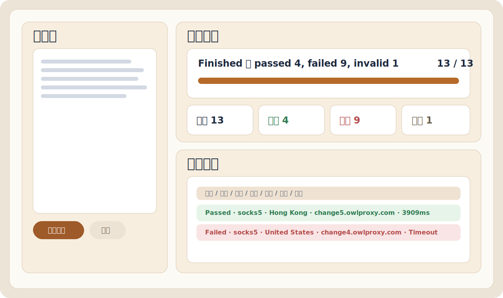
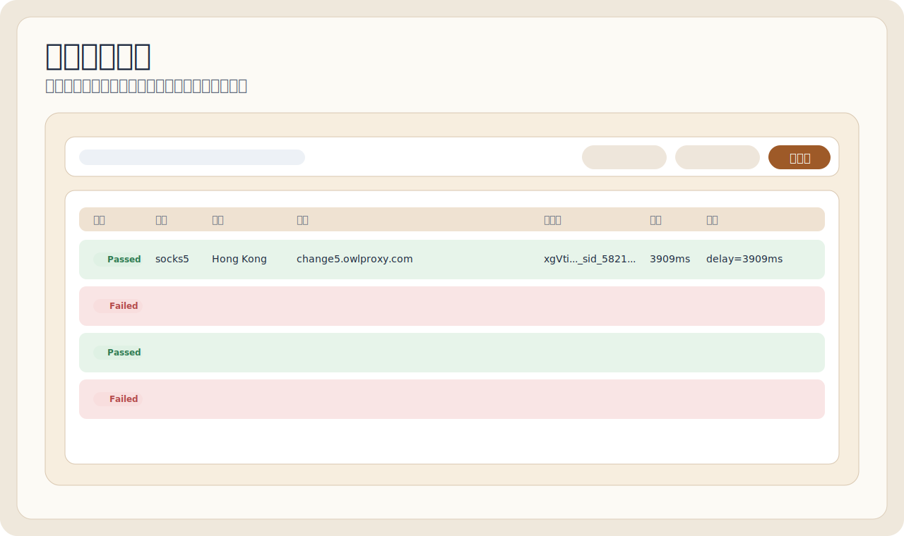
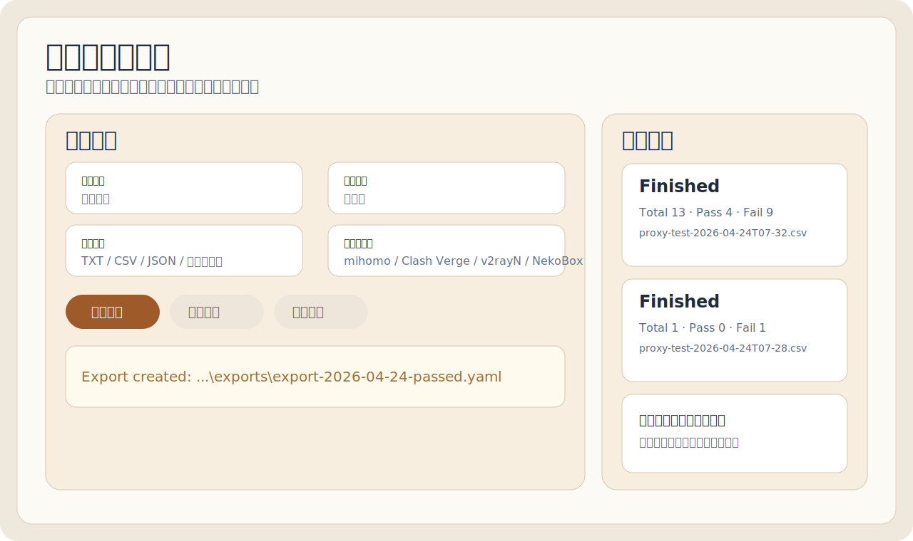

<div align="center">


# Qproxyhub

### 本地代理测试与导出工作台

[](#)
[](#)
[](#)
[](#)

一个专注于 **代理连通性检测、历史复测、结果筛选与多客户端导出** 的本地工具。

<p>
  <a href="https://github.com/hnsxyren1023-commits/Qproxyhub/releases/tag/v0.1.0">
    
  </a>
  <a href="https://github.com/hnsxyren1023-commits/Qproxyhub/releases/tag/v0.1.0">
    
  </a>
</p>

</div>

---

## 产品线导航

- 当前仓库主线：`Qproxyhub`（本地代理测试与导出工作台）
- 第二产品线（已启动 MVP）：[`mihomo-ui`](./mihomo-ui/README.md)
- 官方 UI 本地部署（MetaCubeXD）：[`mihomo-ui-official-host`](./mihomo-ui-official-host/README.md)
- 官方 UI 源码获取脚本：`tools/download-official-metacubexd.ps1`

---

## 双 UI 并行使用

你现在可以同时使用两套 UI：

- 自研 UI：`http://127.0.0.1:8877/`
- 官方 UI（MetaCubeXD）：`http://127.0.0.1:8878/`

一键对比启动：

```text
启动-双UI对比.bat
```

---

## 产品定位

Qproxyhub 是独立于 `mihomo + UI` 之外的另一条产品线，定位为：

- 代理可用性批量检测
- 失败原因诊断
- 历史任务回放与复测
- 多种格式和多客户端导出

---

## 主要能力

- 支持协议：`socks5`、`http`、`hy2`、`vless`、`vmess`
- 单条即时反馈，不需要等全部完成
- 进度、当前节点、通过率、失败原因实时展示
- 详细结果可排序、筛选、单选/多选复制
- 历史任务可回放、失败项可重试
- 导出支持：
  - 原始链接：TXT
  - 表格数据：CSV / JSON
  - 客户端配置：mihomo / Clash Verge / v2rayN / NekoBox

---

## 界面预览

<div align="center">
  
</div>

<div align="center">
  
</div>

<div align="center">
  
</div>

---

## 快速开始

### 1. 下载

前往 [Releases](https://github.com/hnsxyren1023-commits/Qproxyhub/releases/tag/v0.1.0) 下载：

- `Qproxyhub-v0.1.0-portable.zip`（推荐）
- `Qproxyhub.exe`（单文件启动器）

### 2. 启动方式

1. 双击 `Qproxyhub.exe`
2. 或双击 `Qproxyhub-启动.bat`
3. 或 PowerShell 手动启动：

```powershell
cd D:\Xcode\20260423_Qproxyhub
powershell -ExecutionPolicy Bypass -File .\start-proxy-tester.ps1
```

---

## 运行要求

- Windows 10 / 11
- Node.js 24+
- 可用的 mihomo 内核

默认检测路径：

```text
C:\Program Files\nodejs\node.exe
C:\Program Files\mihomo-windows-amd64-v1.19.24\mihomo-windows-amd64.exe
```

---

## 推荐测试参数

- 超时：`8 秒` 或 `12 秒`
- 并发：`1 条（更稳）`

这样更接近人工单条直测，能减少并发压测导致的假失败。

---

## 目录结构

```text
Qproxyhub/
├─ docs/
│  └─ assets/
├─ release/
│  ├─ Qproxyhub.exe
│  └─ Qproxyhub-v0.1.0-portable.zip
├─ tools/
│  └─ QproxyhubLauncher.cs
├─ web/
│  ├─ index.html
│  └─ assets/
│     ├─ app.js
│     └─ styles.css
├─ server.mjs
├─ start-proxy-tester.ps1
├─ Qproxyhub-启动.bat
├─ 使用方法.txt
└─ README.md
```

---

## 文档

- [使用方法](./使用方法.txt)
- [故障排查](./docs/故障排查.md)
- [更新日志](./CHANGELOG.md)
- [开源协议](./LICENSE)

---

## 说明

- 本仓库仅对应 `Qproxyhub` 产品线
- `mihomo + UI` 将作为另一条独立产品线维护
